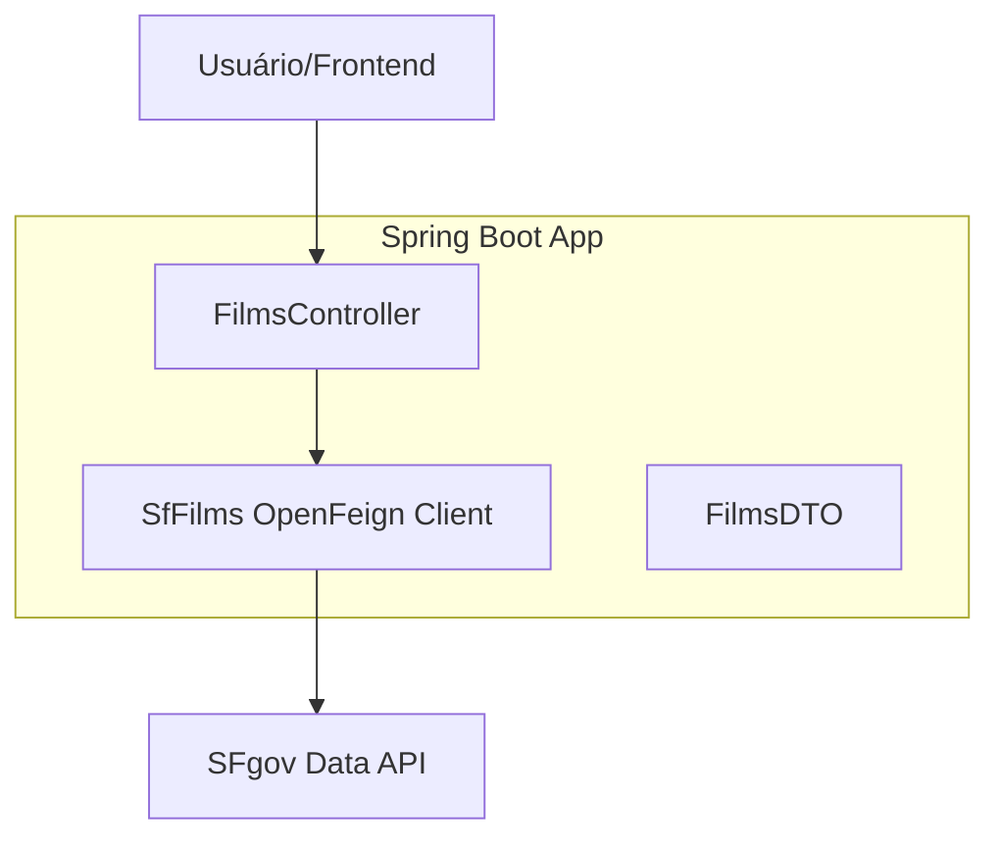

<div align="center">

# 🎬 FilmsLocation API

### REST API de Consulta de Locais de Filmagem em San Francisco

[](https://www.oracle.com/java/)
[](https://spring.io/projects/spring-boot)
[](https://spring.io/projects/spring-cloud-openfeign)
[](https://www.docker.com/)
[](https://swagger.io/)
[](https://github.com/features/actions)

</div>

---

## 📸 Preview (Swagger UI)

<div align="center">
  
</div>

---

## 📌 Sobre o Projeto

A **FilmsLocation API** é uma solução robusta para consulta de locais de filmagem na cidade de San Francisco. A API consome dados diretamente da **SFgov Data API**, processando e disponibilizando endpoints simplificados para que aplicações frontend ou outros serviços possam listar e buscar locações de filmes icônicos.

Construída com foco em **performance e manutenibilidade**, a aplicação incorpora:

- ✅ **Integração Declarativa** com OpenFeign para consumo de APIs externas
- ✅ **Arquitetura desacoplada** com uso de DTOs
- ✅ **Documentação interativa** com Swagger / OpenAPI 3
- ✅ **Containerização completa** com Docker e Docker Compose
- ✅ **CI/CD Automatizado** via GitHub Actions para build e testes
- ✅ **Tratamento de dados** para segurança em queries dinâmicas
- ✅ **Suíte de testes** para controllers e integração

---

## 🏛️ Arquitetura

A aplicação segue uma estrutura modular e limpa:

```
📦 MoviesLocation
 ├── 🎮 controller/      # Endpoints REST e lógica de entrada
 ├── 🔌 client/          # Abstração OpenFeign para APIs externas (SFgov)
 ├── 📤 dto/             # Objetos de Transferência de Dados (Data Transfer Objects)
 └── 🧪 test/            # Testes automatizados (JUnit 5 e Mockito)
```

### Fluxo de Dados



---

## 🚀 Endpoints da API

### 🎥 Filmes e Locais
| Método | Endpoint | Descrição | Parâmetros |
|--------|----------|-----------|------------|
| `GET` | `/api/films/allFilms` | Lista todas as filmagens e locais | — |
| `GET` | `/api/films/search` | Busca locais por título do filme | `title` (obrigatório) |

**Exemplo de Busca:**
```bash
GET /api/films/search?title=Ant-Man
```

---

## 🐳 Rodando com Docker

A forma mais simples de subir a aplicação em qualquer ambiente:

**1. Clone o repositório:**
```bash
git clone https://github.com/betolara1/code-chalenger-uber.git
cd code-chalenger-uber
```

**2. Suba o container:**
```bash
docker-compose up --build -d
```

**3. Verifique o status:**
```bash
docker-compose ps
```

A API estará disponível em: `http://localhost:8080`

---

## 🧪 Testes

A API possui uma suíte de testes para garantir a integridade dos endpoints e do fluxo de dados.

```bash
# Executar todos os testes
./mvnw test
```

Os testes incluem:
- **FilmsControllerTest**: Validação de endpoints e parâmetros.
- **Context Loads**: Verificação de inicialização do contexto Spring.

---

## 💻 Rodando Localmente (Desenvolvimento)

**Pré-requisitos:**
- Java 21
- Maven 3.9+

```bash
# Navegue até a pasta do projeto
cd MoviesLocation

# Execute a aplicação
./mvnw spring-boot:run
```

---

## 📖 Documentação Interativa (Swagger)

Com a aplicação rodando, acesse a documentação completa:

🔗 [http://localhost:8080/swagger-ui/index.html](http://localhost:8080/swagger-ui/index.html)

---

## 🛠️ Stack Tecnológica

| Tecnologia | Versão | Finalidade |
|-----------|--------|------------|
| Java | 21 (LTS) | Linguagem principal |
| Spring Boot | 3.5.9 | Framework base |
| Spring Cloud | 2025.0.1 | Ecossistema Cloud |
| OpenFeign | — | Consumo de API externa |
| SpringDoc OpenAPI | 2.8.5 | Documentação Swagger |
| Lombok | — | Redução de código boilerplate |
| Docker | — | Containerização |
| JUnit 5 + Mockito | — | Testes automatizados |
| GitHub Actions | — | CI/CD |

---

## 👨‍💻 Autor

Desenvolvido por **Beto Lara** — Backend Developer

[](https://github.com/betolara1)

---

<div align="center">

**FilmsLocation API** — Facilitando o acesso a dados cinematográficos de San Francisco.

</div>
