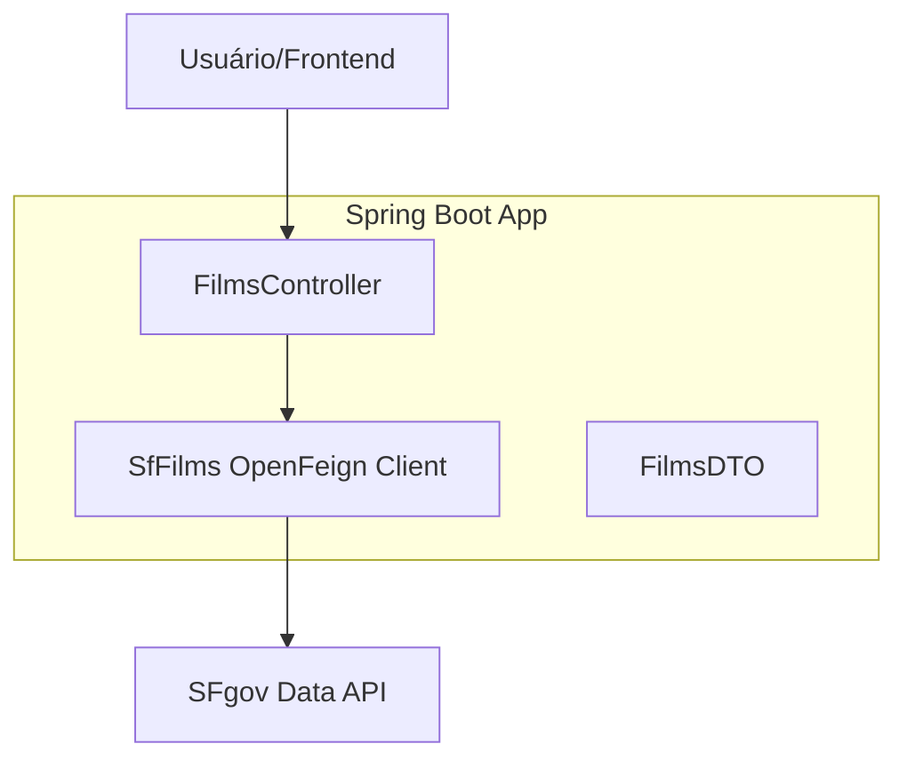
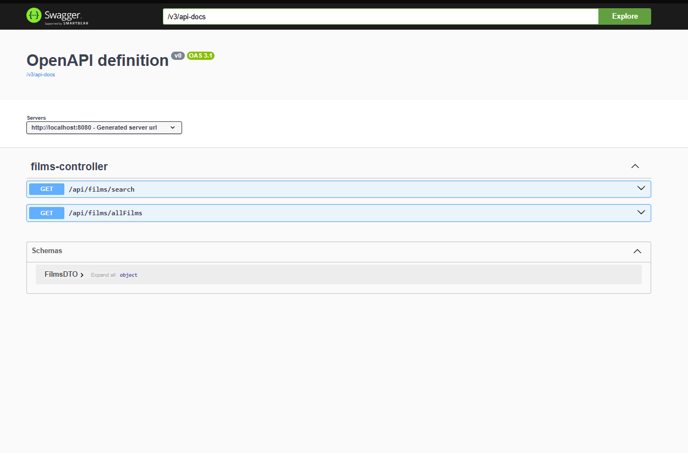

# FilmsLocation 🎬

Uma aplicação Spring Boot robusta para consulta de locais de filmagem em San Francisco, integrando-se com APIs externas e oferecendo documentação completa.

## 🎯 Objetivo & Problema

### O Problema
Desenvolvedores e entusiastas de cinema muitas vezes têm dificuldade em encontrar localizações exatas onde seus filmes favoritos foram gravados em San Francisco. As informações estão dispersas ou em APIs complexas de consumir diretamente.

### O Objetivo
Fornecer uma API REST simplificada e performática que centraliza dados de filmagens de San Francisco, permitindo buscas rápidas por título e listagem completa, com tratamento de dados e segurança.

---

## 🏗️ Arquitetura

A aplicação segue uma arquitetura baseada em **Microservices Ready** utilizando Spring Boot e Spring Cloud:



- **Controller Layer**: Expõe os endpoints REST e gerencia a lógica de entrada.
- **Client Layer (Feign)**: Abstração declarativa para consumo da API externa.
- **DTO Layer**: Objetos de transferência de dados para garantir desacoplamento.

---

## 🚀 Como Rodar

### Ambiente de Desenvolvimento (Dev)

**Pré-requisitos:** Java 21, Maven.

1. Clone o repositório:
   ```bash
   git clone <url-do-repositorio>
   cd code-chalenger-uber/MoviesLocation
   ```
2. Execute a aplicação:
   ```bash
   ./mvnw spring-boot:run
   ```
3. Acesse: `http://localhost:8080`

### Ambiente de Produção (com Docker)

**Pré-requisitos:** Docker e Docker Compose.

1. Na raiz do projeto, execute:
   ```bash
   docker-compose up --build
   ```
2. A API estará disponível em `http://localhost:8080`.

---

## 📖 Exemplos de Request/Response

### Listar Todos os Filmes
**GET** `/api/films/allFilms`

**Response:**
```json
[
  {
    "title": "180",
    "locations": "Epic Roasthouse (369 Embarcadero)",
    "director": "Jayendra",
    "latitude": 37.7907,
    "longitude": -122.39
  }
]
```

### Buscar por Título
**GET** `/api/films/search?title=Ant-Man`

**Response:**
```json
[
  {
    "title": "Ant-Man",
    "locations": "Steinhart Aquarium (California Academy of Sciences, Golden Gate Park)",
    "director": "Peyton Reed",
    "latitude": 37.7701,
    "longitude": -122.466
  }
]
```

---

## 🔍 Swagger & Documentação

A documentação interativa da API está disponível via Swagger UI após iniciar a aplicação:

🔗 [http://localhost:8080/swagger-ui/index.html](http://localhost:8080/swagger-ui/index.html)



---

## 🐳 Docker

O projeto está totalmente containerizado. O arquivo `dockerfile` realiza o multi-stage build para otimizar o tamanho da imagem final, e o `docker-compose.yml` gerencia a execução do serviço.

---

## 🧪 Testes

A aplicação conta com uma suíte de testes unitários cobrindo os principais fluxos dos controllers, garantindo a integridade da API e o tratamento correto de parâmetros.

Para rodar os testes:
```bash
./mvnw test
```

---

## ⚙️ GitHub Actions (CI/CD)

Implementamos um workflow de Integração Contínua que automatiza:
- **Build**: Compilação do código em cada push/PR.
- **Testes**: Execução automatizada da suíte de testes.
- **Lint**: Verificação básica de integridade.

O status pode ser acompanhado na aba **Actions** do repositório.

---

